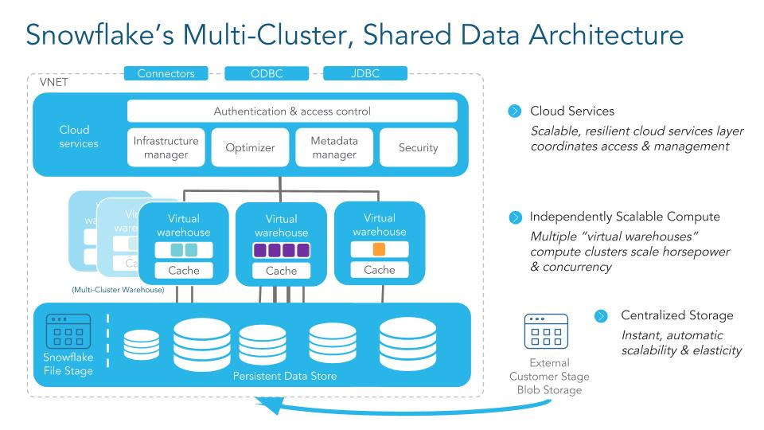
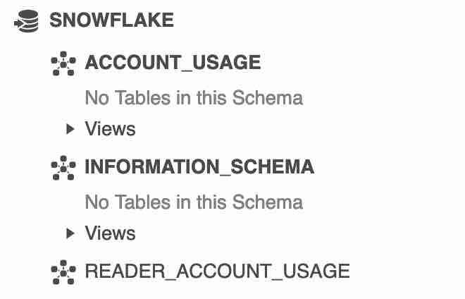
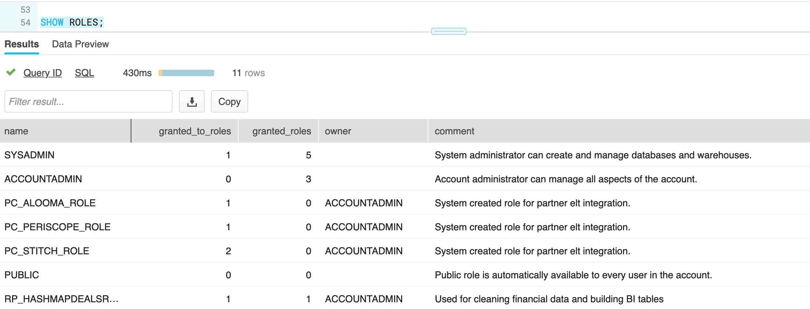
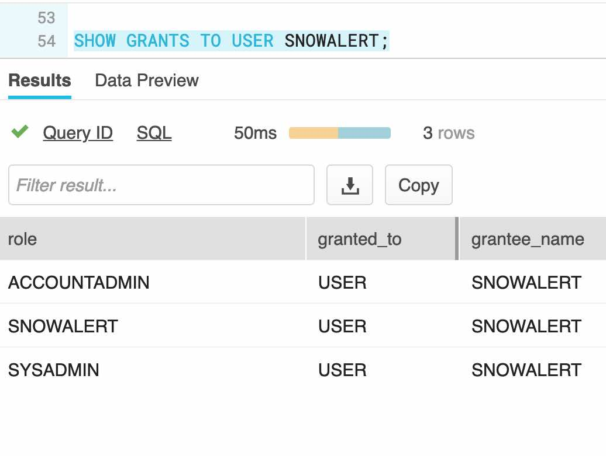
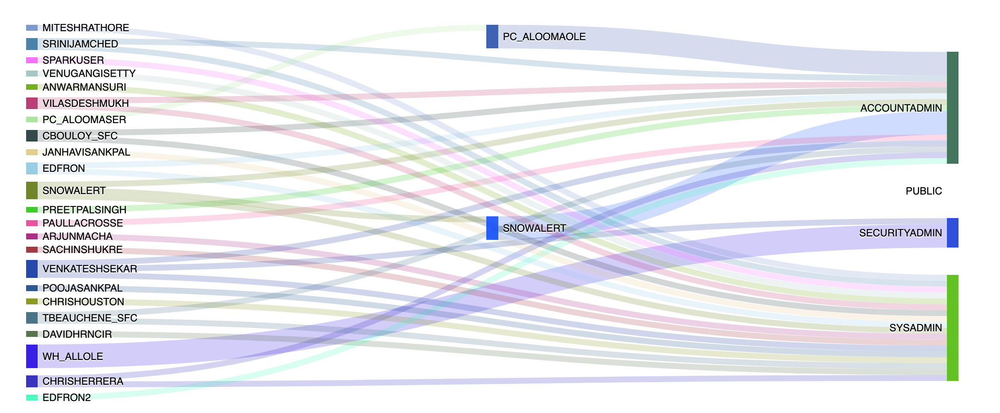
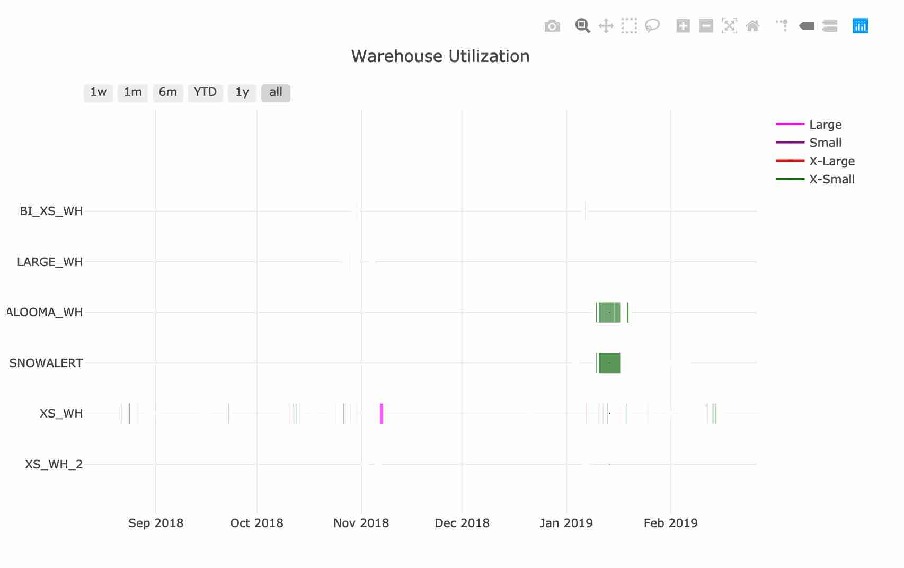
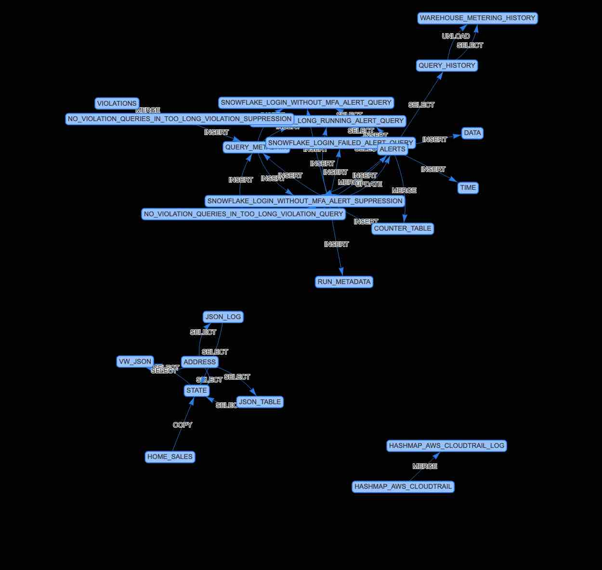
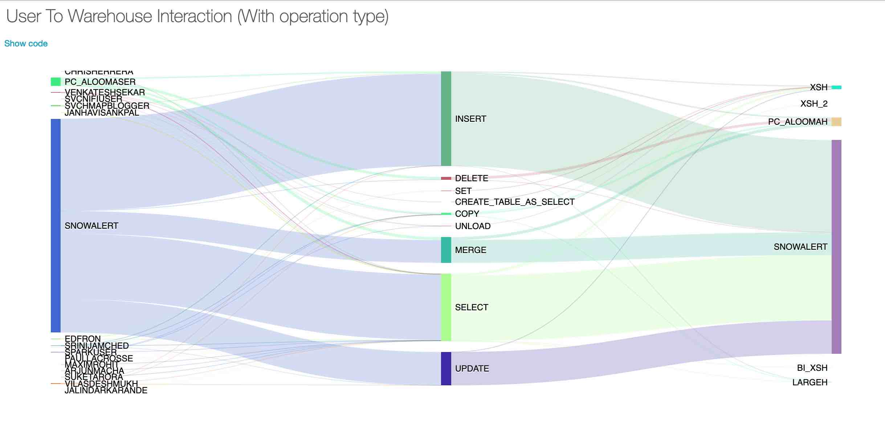

# Visualizing Snowflake usage

Snowflake is a data warehouse built for the cloud, it offers an unique solution of having a multi compute 
cluster over a shared storage layer, managed by a centralized metadata store. It offers a unlimited virtually
elastic compute cluster instances called warehouses operating on top of a virtually unlimited storage.

Here are some stats from a recent interaction that we got from snowflake.

|   |   | 
|---|---|
| Largest number of tables single DB  | 200,000 |
| Single customer most data  |  > 40 PB  |
|  Single customer most users | > 36,000  |

Patterns do exists where by a single snowflake account can accommodate multi-tenant functionality too. You 
could literally host all of your structured data from your data lake into snowflake.

As your enterprise starts utilizing snowflake more and more; you might be asking:
- How effectively are we using snowflake ? 
- Are we burning credits with improper sizing of warehouses ?
- How can effectively streamline our loading and egress process such that we use minimal amount of credits.
- What are the roles, privileges and users accessing the system ?
- Given a user can assume different roles, and that a role has privilege to multiple objects (tables, views ..). Can we 
    produce a report on just those object that the user used? What type of operations did they do on it ?
- Can we produce a heatmap for warehouse usage over a period range
- How often the warehouse gets resized

on and on ...

While the snowflake webui does facilitate the ability to query the data and show simple graphs of usage metrics. It is 
very limited in my regards. From my interaction with the snowflake team, it was clear that these views are left to be 
implemented by the customer, as they seem fit. Snowflakes team have a lot of features on their hands to figure and grow 
on its own wonderful offering.

## Where is the data ?
Ok, to build these views how can I get the usage data, especially given the fact snowflake maintain the metadata store 
and we cannot interact with the meta data store too.

Snowflake does provide a historic view of metrics via the 'Snowflake' database on the ['Account_Usage' schema](https://docs.snowflake.net/manuals/sql-reference/account-usage.html).
The schema provides various views like :
- warehouse usage metrics
- Query history
- Table storage metrics and more

By default only an Accountadmin and partially Securityadmin have access to this database. The views in the Account_Usage 
schema are restricted from being cloned. The accountadmin user can issue a 'IMPORTED PRIVILEGES' privilege to a specific 
role to view the data. Refer to [Enabling Account Usage for Other Roles](https://docs.snowflake.net/manuals/sql-reference/account-usage.html#enabling-account-usage-for-other-roles).

There are also other information like users and roles which are not present as part of these views. For example, to get 
the list of users you got to use the 'SHOW USER' command and to get the roles, use the 'SHOW ROLES' command. Again these
are available only to the Securityadmin role.

Now let's get back to the issue at hand.

## The why's ,who's , what's
Why do I want to consider the views mentioned above? ,who are my target audience? And what will they achieve if these 
views do exist?

While the data for answering the various queries exist via the various views in the Account_Usage schema and SHOW commands.
They are however in tabular format. For hard core guys these might be sufficient ,it is not clear when we want to communicate
effectively to larger audience like dev manager, business leaders, security admin groups etc.. 

For example; here is a screenshot of roles hierarchy, via the show roles command. 

You can get the list of users and their granted roles via a combination of 'SHOW Users' and 'Show grants to user' command. 
Here is a screenshot of 'Show GRANTS TO USER'

Now try to stitch these tabluar structure together and explain to your audience (good luck!!). While for small usage of 
snowflake it might be ok to do it via hand, as more and more data is brought into snowflake and more users/processes 
are actively using snowflake it becomes harder to visualize and explain to team.

A visual representation like a tree, Sanskey ,chord ,heatmap diagram speaks a thousand words. Example here is a visual 
representation of above scenario of users/roles and their hierarchy.

If you are able to quickly infer that there is an issue, from the above screenshot (multiple users have an AccountAdmin 
role) then I just proved my point. 

Thus my aim is via these visual representation I want to make life of dev managers, architects etc quicker and easier to 
answer queries and also make decisions.

If the above scenario has piqued your interest, then let's carry on. 

### How to do this ?
So how do we go about doing this visualization? What technology exists that will help me to do a quick prototype and also 
have facility to evolve as I come up with more views?

While there are many ways to achieve this, I am choosing to solve the problem using Databricks. I thought of initially 
using via tools like Power-BI, Tableau etc but quickly realized that as I was building for various scenarios, we do need 
capabilities to do complex data munging. Also for a high usage of snowflake account the data will grow. Imagine processing 
a year worth of snowflake usage from these views.

Spark provides the perfect mix for :
- processing small dataset and can handle as data grows.
- Provides ability to do complex data munching via UDF, custom functions etc..
- Do ml on data (yes ML). There are scenario popping in my head.
- Do graph based processing of data.

The Databricks notebook Environment provides the capabilities of what I was looking for:
- Easy configuration of computation cluster
- Interactive environment using notebook
- Job scheduling
- Connectivity to snowflake
- Simple dashboards
- Ability to use prominent visual libraries like d3, plotly ..
- Ability to connect power bi ,tableau etc. using jdbc/odbc with produced data.
- Cloud based end to end. 
- Add more views by defining new notebooks,
- Source control integration.
- Real time collaboration

The cloud based functionality is awesome in the sense that I can create these views only if some one asks for it. If no 
one cares, no clusters running and hence literally no cost.

## Protoype
To start of I have developed some visual notebooks, and these are available in my git repo
[snowflake-inspector](https://github.com/venkatra/snowflake-inspector).
 
Being a notebook environment; i choose to comment and explain the usage via comments and markdown in the notebook. If you
are interested you can import these notebooks and read them.

###### Disclaimer
 - There are different ways to solve an problem. What I am demonstrating here can be used a rough guide/approach. 

 - I am not an UI expert or a wizard. The demonstrated visual appeal(graph, colour choice etc..) is left to users. You 
   can clone the repo and rebuild that notebook to your liking.

 - I built these views based of our snowflake trial account. Hence not a lot of traffic, warehouse, usage metrics exists. 
   For proper functioning in your environment, which might have high usage and data, be ready to dig in clone and tune 
   the code/ views accordingly. Especially around how much you want to filter out to accommodate chart. for achieving 
   the functionality I used community databricks hence not a lot of cluster was needed, so far.

 - Since usage on my account was low, all the views were generated using databricks community databricks edition.

### Notebook to snowflake users and roles
 As mentioned previously, to get the data you need to be an Accountadmin/Securityadmin. Running these notebook using 
 those account credentials would not be acceptable. 
 
 With some limitation/acceptance; I am choosing to solve the issue as follows.
 - Create a separate role SNWFLK_INSPECTOR
 - Create a separate user SVCHMAPBLOGGER
 - Grant SNWFLK_INSPECTOR role to the user SVCHMAPBLOGGER
 - Grant permissions for the SNWFLK_INSPECTOR role to access the Account_Usage schema
 - Create a separate database which is accessible only by SecurityAdmin and SNWFLK_INSPECTOR role

The commands to achieve the above are available in the script [initial_setup.sql](./scripts/initial_setup.sql).

To execute the output of the command 'SHOW USER'; it requires a 'manage grant' privilege. I don't think this privilege 
should be given to the SNWFLK_INSPECTOR role. Hence to solve the problem ,we execute the command as security admin and 
populate the result into a transient table. This is available in the script [Snapshot_data.sql](./scripts/snapshot_data.sql)..
One caveat is that, we need to run the script just on the days the report needs to be viewed. As the command result in 
taking a snapshot of the users dataset.
 
**Note:** Do not give this user account anymore than the above priviliges. It also should not be used for multiple purposes.

#### Views

The following are some of the views that I have built so far. If interested you can read them in their individual notebooks
on how they were built

##### __View : user role hierarchy__
 Visualize role hierarchy and map users to their role
 
   

 [Notebook : user-with-roles-relationship-with-hierarchy.html](./notebooks/user-with-roles-relationship-with-hierarchy.html) 

##### __View : warehouse utilization__

The [WAREHOUSE_METERING_HISTORY(https://docs.snowflake.net/manuals/sql-reference/functions/warehouse_metering_history.html#warehouse-metering-history)
return the hourly credit usage. During the usage, the warehouse could be resized up and down. The [Query_History](https://docs.snowflake.net/manuals/sql-reference/account-usage/query_history.html#query-history-view)
does offer some information on the size of the warehouse when a specific query was issued. Though there are some gaps, 
I am assuming that the size will retain previous record size.

By way of projection, joining and grouping the following view demonstrates the timeline of all warehouse usage over a time 
period. The color of the bar indicate different warehouse size

By above view I am able to demonstrate which warehouse is used the most. Also which warehouse had frequent resizing.

The frequency of resizing would lead to queries like
- why is the resizing happening
- Is it because of a query complexity ,data or no of queries
- can the load be shifted to another idle warehouse
and so on.

##### __View : Relation among tables__

The tables can have foreign key relationships, however snowflake does not enforce them. Irrespective of foreign key 
relationships, tables gets joined and their usage can be interpreted based on the query statement. These join may occur 
due to natural matching keys, example ids or not so natural keys ,like using the like /in operators.

Inspecting issued query statements provides a way of determine the relationships among tables. They could answer queries 
such as:
- under which operations(insert vs merge vs select) are the table related
- How often these statement are issued, which involves joint multiple tables.
- Is there a cluster of closely related tables in my dataset.
- Are there any cross database, schema table relationship

In order to solve for the above scenario it lead me to use capabilities using Spark Graph. Once built, building the visual
graph was simple. The resulting visualization is 

If you could infer at quick glance that there are 3 clusters of related tables, well I achieved my stated goal again.

##### __View : Users and warehouse interaction__

A user can have access to operate on multiple warehouse. They might use these warehouse based on different roles/operations.
Here is a visual of how the users were interacting with the different warehouses and the type of operations that they
performed

Using this we could potentially identify if users are utilizing only a large size warehouse for all their work and if
we could divert them to smaller size ,to potentially save credits.

### Continuity
Have we achieved all the views there is ? Certainly not, this is just tip of the ice. There are lot more things you 
can achieve. For thoughts:

- Identify and group queries that are similar
- List out unique set of queries executed.
- Which query is costly and how often it is executed.
- Do relate the user, warehouse etc where the queries are executed.

And so on so forth.

## Final thoughts
If you are following my thoughts so far, atleast in my mind, I am going may be there is a pathway here for a data 
governance functionality.

The spark/databricks environment provided a good opportunity to handle as more data is present in original views. And 
also the cloud nature makes it easy to get charged only on a need basis.

If your data is in AWS, maybe there are more scenarios if you marry the data from snowflake and AWS glue catalog.

If the above approach looks plausible, may be a community effort can be done to build out and add more such notebooks 
into the repo. Thus could be shared by snowflakers (hmmm is that a new community if we could call ourselves!!). 

There is actually town named [Snowflake in Arizona](https://www.google.com/maps/place/Snowflake,+AZ+85937,+USA/@34.5261085,-110.1577387,12z/data=!3m1!4b1!4m5!3m4!1s0x872f3c5a7ae9d803:0xb640425546bb2730!8m2!3d34.5133698!4d-110.0784491)

__*For now happy snowplowing data into snowflake db!!*__

